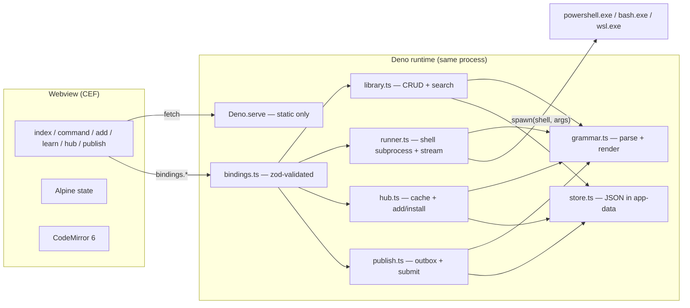

# Command Centre — Implementation Plan

Save a command once, run it anywhere. A Windows desktop app that stores reusable shell commands as **templates with typed inputs**, runs them in the right shell and working directory, and ships a community library of shared templates plus a publish flow.

- **Backend:** Deno 2.9.6 `deno desktop` (CEF backend) — `Deno.serve` for static assets, `win.bind()` for the API
- **Frontend:** classless-ish HTML ported from [`design/`](../design/), Alpine.js 3 for state, Mustache for templating (server-side on the website, runtime strings in the app)
- **Validation:** `npm:zod` on every binding boundary
- **Target:** Windows 11 first; `deno desktop` cross-compiles later
- **Companion line:** `website/` (Cloudflare Workers + Hono) for the Community Hub, `api/` for the same routes as a standalone Worker

This plan is grounded in the same stack that ships **Compressy** (`C:/projects/compressy`), whose desktop app is the structural reference: identical `deno.json` task set, identical `main.ts` serve/window split, identical `win.bind()` + zod contract, identical `static/` + `vendor/` layout, identical app-data JSON persistence.

---

## 1. What exists today

| Path | State | Role |
|---|---|---|
| `design/*.html` | 6 pages, complete | Visual + behavioural source of truth. Standalone, inline `<style>`, inline demo `<script>`, hardcoded demo data, `localStorage` |
| `plan/stack.md` | written | Mandated stack (Deno Desktop + Deno, Alpine + Mustache; website/API on Workers + Hono + D1) |
| `desktop-app/` | **empty** | Target for §5 |
| `website/` | **empty** | Target for §12 |
| `api/` | **empty** | Target for §13 |
| `design/icons/` | 3 SVGs | `powershell.svg`, `bash.svg`, `ubuntu.svg` — the shell picker assets |
| `plan/known-bugs.csv` | empty header | Running bug list (§15 seeds it) |

### 1.1 The design pages

All six are `div class="app-window"` shells with a `nav.tabs` (My commands / Community Hub / Learn) and no framework. Demo scripts fake everything that would touch the OS.

| Page | Lines | Purpose | Writes |
|---|---|---|---|
| `index.html` | 274 | Command list — cards with inline shell picker, variable panel, simulated terminal | `cc-commands` (unused helper), `cc-var-values`, `cc-shells` |
| `command.html` | 402 | Command detail — raw template, rendered preview, metadata table, metadata JSON export | `cc-published` (unused helper) |
| `add.html` | 540 | Authoring — CodeMirror editor, live `{{token}}` parsing, variable metadata, cwd picker | `cc-commands` |
| `learn.html` | 300 | Input-syntax reference — 129 static rows, filter by text + widget | — |
| `hub.html` | 256 | Community Hub — 10 demo commands, package rail, search, install/add | `cc-hub-sort`, `cc-clis`, `cc-added`, `cc-hub-recents`, `cc-commands` |
| `publish.html` | 244 | Publish to hub — command select or metadata file, reviewer info, install script | `cc-publish-queue` |

**No page is a working app.** Confirmed demo-only: execution (`runCmd` replays a hardcoded `lines` array on a 260 ms timer), CLI installs (`cliState` + a 4-step interval), hub "adds" counters, and every transcript string, which ends in `(simulated)`.

### 1.2 The `{{input.*}}` grammar (the core asset — port verbatim)

**Canonical form:** `{{input.<type>[:<default>]}}` plus one optional dot-suffix modifier on the type.

```js
/^input\.([a-z0-9]+)(\.autogenerate)?(?::([\s\S]*))?$/
```

Three positions, and `learn.html`'s three modifier cards are exactly these three — do not conflate them:

| # | Position | Syntax | Meaning |
|---|---|---|---|
| 1 | **type** | `input.uuid` | the token name, must exist in the 135-row registry |
| 2 | **dot-suffix modifier** | `input.uuid.autogenerate` | prefill a generated value, still editable after |
| 3 | **colon default** | `input.text:hello` | the default value, in whatever form that type takes |

**Everything after `:` is a default value**, never a modifier. What a default looks like depends on the type:

| Type | Default form | Example |
|---|---|---|
| text / number / date / color / password / file | the literal value | `{{input.color:#f6f6f6}}` `{{input.port:8080}}` |
| select / radio | comma list of options, optionally `=<default>` | `{{input.select:zip,tar.gz}}` `{{input.select:zip,tar.gz=tar.gz}}` |
| range | `<min>-<max>`, optionally `=<default>` | `{{input.range:18-28}}` `{{input.range:0-100=75}}` |
| checkbox | the flag text, optionally `=off` | `{{input.checkbox:--rm}}` `{{input.checkbox:--dry-run=off}}` |

The two compound types put their default inside the colon section with `=`: for select/radio the last `=value` wins if that value contains no comma; for range it is parsed separately from the bounds.

Outer delimiters are matched with `/\{\{\s*([^{}]*?)\s*\}\}/g` (non-greedy, no nesting). A token whose name is absent from the type registry is **not** a token: it stays in the template and renders verbatim. This is what makes the syntax safe to sprinkle inside arbitrary shell text.

**Checkbox truthiness** (`=off` suffix, case-insensitive): checked set `1\|t\|true\|on\|checked\|yes\|y`; unchecked set `0\|f\|false\|off\|unchecked\|no\|n`. Bare `{{input.checkbox:--rm}}` starts **checked**.

> **Undocumented parser tolerance — do not document, consider dropping.** All four parsers also accept `:autogenerate` after the colon (`if (raw.toLowerCase() === "autogenerate") { auto = true; raw = ""; }`), treating it as position 2 written in position 3. It appears in **zero** documented examples and zero demo commands. It is very likely an unintended consequence of the single-regex parse, and it is mildly harmful: it makes `{{input.text:autogenerate}}` generate a random string instead of using the literal default `autogenerate`. Keep the code path for backward compatibility when reading stored commands, but do not use or document the form, and never offer it in autocomplete.

**Type registry: 135 tokens**, identical key set and widget assignment in `index.html` (`CC_INPUT_TYPES`) and `command.html` (`CC_TYPES`) — verified programmatically, 0 mismatches. Widget histogram: `text` 53, `select` 30, `file` 13, `number` 12, `range` 9, `checkbox` 7, `color` 4, `password` 4, `date` 2, `radio` 1.

The authoritative shape is `index.html`'s array form, because it carries the human label and — for 45 rows — the built-in default params that `index.html` actually depends on:

```js
["input.extension", "select", "File extension", "mp4,mkv,mov,mp3,wav,avi,flv,webm"]
["input.crf", "range", "Quality CRF (lower is better)", "0-51"]
["input.checkbox", "checkbox", "Flag", "--flag"]
```

`command.html` has the same names as a bare `{name: widget}` map and **no** labels or defaults — keep one registry, not two.

**Aliases** (declared only in `add.html`):

```
input.hexcolor | input.bgcolor | input.fgcolor  → input.color
input.token    | input.apikey  | input.secret   → input.password
input.since    → input.date
```

**Repeated tokens get their own value.** `parseVarInstances` keeps every occurrence: the second `{{input.dir}}` gets `iid = "input.dir#2"` and all instances share `total: 2`. `renderCmd` substitutes occurrence-indexed key first, then base key, then leaves the raw token.

### 1.3 The saved-command shape

Union across all six pages. Everything below is read or written by real code; nothing is invented.

```ts
type AskMode = "every" | "once";

interface SavedCommand {
  id: string;        // "u"+Date.now() (add) | "hub-<hubId>-"+Date.now() (hub) | seed ids
  name: string;      // required
  cmd: string;       // required — template with {{input.*}} tokens
  desc: string;
  tag: string;
  cwd: string;       // Windows abs path; UI fallback "C:\\projects\\app"
  lines: string[];   // demo transcript — DROPPED in the real app (§7.4)
  askMode: AskMode;  // default "every"
  custom?: true;
  fromHub?: string;  // hub id provenance; preserved across edits
  vars?: VarMeta[];  // author metadata: label/description/per-option labels
}
```

`vars[]` carries `{key, iid, occ, total, type, name, params, auto, default, token, checkedDef?, optionsArr?, label?, description?, options?, example?}`. **Values never live inside the command** — they are stored separately, keyed `commandId → iid → string`.

### 1.4 Metadata export document (the publish handoff)

`command.html` already defines this exact contract; the desktop app must reproduce it byte-compatibly so `publish.html`'s file loader keeps working.

```json
{
  "app": "command-center",
  "kind": "command-metadata",
  "version": 1,
  "exportedAt": "2026-09-13T…Z",
  "id": "u1757740800000",
  "name": "…", "description": "…", "command": "…",
  "workingDirectory": "C:\\projects\\app", "tag": "…", "askMode": "every",
  "variables": [
    { "token": "{{input.vcodec:libx264,libx265=libx264}}", "type": "select",
      "label": "Video codec", "description": "…", "default": "libx264", "auto": false,
      "occurrence": 2, "of": 2,
      "options": [{ "value": "libx264", "label": "H.264", "description": "…" }],
      "example": "libx264" }
  ]
}
```

Filename: `command-<id sanitized [^a-zA-Z0-9_-]+ → "-">.metadata.json`. Note the field renames the publish page already relies on: `command`→`cmd`, `description`→`desc`, `workingDirectory`→`cwd`.

### 1.5 Design defects to fix during the port

These are real, verified, and each has a one-line fix. Do not reproduce them.

| Defect | Evidence | Fix |
|---|---|---|
| Built-in ids don't intersect between pages — every built-in card link lands on the fallback showcase | `index.html` seeds `n1..n7`; `command.html` seeds `c1..c9` + `showcase`; intersection empty | One seed module (§6.3) |
| `command.html` never unhides `#missing`; unknown ids silently render the showcase | `command.html:396` sets `miss.hidden=true` unconditionally | Real "command not found" state (§8.2) |
| `rangeSpec` ignores declared bounds whenever params contain `=default` — every demo range | `rangeSpec("18-28=23")` → `{min:0,max:100}` | Strip the `=default` before the bounds regex (§7.2) |
| Two preview functions disagree for the same token (`s3cr3t` vs `••••••`, `input.mp4` vs `path/to/file`) | `ccExampleFor` (`index:196`) vs `exampleFor` (`command:161`) | One `exampleFor` (§7.2) |
| `#count` placeholder says `5 saved` but 7 defaults ship | `index.html:154` vs `:169-177` | Computed only |
| Every `.tags` second span renders literal `local`, built-ins included | `index.html:216` | Derived from `custom`/`fromHub` |
| `cc-published` badge can never light up | `setPub` defined at `command.html:220`, never called | Real publish status (§11.4) |
| `saveCustom`, `parseVars` (index), `#missing`, `.cmd[data-id]` are dead | single-occurrence symbols | Deleted in the port |
| `hub.html` registry maps any unknown `input.*` to `text` | `hub.html:148` permissive fallback | Use the single registry (§7.2) |

---

## 2. Scope

### In scope (v1)

**Authoring**
- Create / edit / duplicate / delete commands; name, description, tag, working directory
- CodeMirror 6 editor with `{{input.*}}` syntax highlighting, unknown-token marking, and two completion sources (type names, then option lists)
- Live variable panel: typed widgets per token, per-variable label + description, per-option labels for choice lists, occurrence badges for repeats
- `askMode`: ask every time, or ask once and remember
- Live preview of the resolved command line with a shell-correct prompt

**Running**
- Real execution via a shell subprocess in the command's `cwd`, streaming stdout/stderr into the card's terminal
- Shell selection per command: PowerShell / Bash / Ubuntu (WSL), from `design/icons/*.svg`
- Cancellation (process-tree kill), exit-code status, copy/clear/hide terminal
- Value validation before run (numbers numeric, dates dated, required fields non-empty)

**Library**
- Command list with search over name + cmd + desc + cwd, tag filter, sort, list/grid view
- Shell picker inline on the card, variable badge, saved-values indicator
- Import/export command JSON; import from metadata document

**Community**
- Hub browse: search, `package:` token, package rail with counts, sort, paging, recents, keyboard navigation
- Package install detection (real `where`/`--version` probe) and "add to mine"
- Publish: pick a command or load a metadata `.json`, reviewer name/email, install script, notes; queue locally, submit when online

**Platform**
- Window geometry + settings persistence, native window frame
- MSI + portable build, app icon from `design/app.ico`
- Offline-capable: no CDN at runtime

### Out of scope (v1)

- macOS/Linux packaging (same codebase, cross-compile later)
- Multi-command pipelines / chaining, scheduled runs, run history beyond the session
- Real shell integration beyond spawning a child process (no PTY, no interactive prompts inside a run)
- Themes beyond the design's single GitHub-flavoured light palette
- Sync of the local library across machines (the hub and publish flows cover sharing)

### Non-goals (explicitly)

- No Electron / Tauri / WebView2 — `deno desktop` with `backend: cef` only
- No React/Vue/Svelte; Alpine + Mustache
- No bundler and no build step for the frontend — plain static files + `vendor/`
- No HTTP API inside the desktop app; bindings are the API (§7.1)

---

## 3. Stack & versions

Mirrors `plan/stack.md` and the pinned set proven in Compressy.

| Component | Choice | Notes |
|---|---|---|
| Runtime | Deno **2.9.6** (installed) | `deno desktop`, node compat |
| Desktop shell | `deno desktop --backend cef` | **Not** `webview` — blank window on Win11 (§15, bug 1) |
| Window | `Deno.BrowserWindow` + `win.bind()` + `Deno.serve` | §7.1 |
| Validation | `npm:zod@^3.25` (lock `3.25.76`) | every binding arg |
| Paths | `jsr:@std/path@^1` (lock `1.1.6`) | `join`, `resolve`, `dirname` |
| Tests | `jsr:@std/assert@^1` (lock `1.0.19`) + `deno test` | §14 |
| Frontend state | Alpine.js 3.x, vendored into `static/vendor/` | no CDN |
| Frontend templates | Mustache 4.2.0 for the website; app uses `templates.js` compiled strings (Compressy pattern) | |
| Editor | CodeMirror 6 — `state`, `view`, `autocomplete`, `commands`, `language`, `legacy-modes` | versions from `design/add.html:7` (§7.5) |
| Process spawn | `node:child_process` `spawn`/`spawnSync` with `windowsHide: true` | `Deno.Command` lacks the flag in 2.9.5/2.9.6 (`denoland/deno#34627`) |
| Website | Cloudflare Workers + Hono 4.13.3 + Mustache + linkedom 0.18.13 + D1, Bun | §12 |
| Packaging | `deno desktop --compress xz` → MSI + Inno Setup installer | §10 |

All frontend libraries are downloaded once into `static/vendor/` during implementation and served locally. No CDN at runtime.

---

## 4. Architecture



Four rules, carried over from Compressy:

1. **Bindings are the API, not fetch routes.** `Deno.serve` serves `static/` only. Every data operation is a `win.bind()` call validated with zod.
2. **State lives in the frontend.** The backend is stateless apart from the command library, settings, hub cache and the publish outbox.
3. **No WebSockets/SSE.** Long-running runs stream through a polled progress binding — binding arguments are JSON-encoded and callbacks cannot cross the boundary.
4. **The grammar is one module.** `grammar.ts` is the single implementation of parse/render/example; the frontend imports the same logic as a static ES module so previews and execution always agree.

---

## 5. Project layout

```
command-centre/
├── plan/
│   ├── implementation.md       # this file
│   ├── stack.md
│   └── known-bugs.csv
├── design/                     # untouched reference; icons/ consumed by the app
├── desktop-app/
│   ├── deno.json               # imports, desktop block, tasks
│   ├── deno.lock
│   ├── main.ts                 # entry: static serve + window adopt + bindings
│   ├── bindings.ts             # all win.bind() registrations; zod at the boundary
│   ├── version.ts              # APP_NAME / APP_VERSION
│   ├── types.ts                # all contracts + zod schemas
│   ├── grammar.ts              # {{input.*}} parse / render / example  ← shared brain
│   ├── registry.ts             # the 135-token type table + aliases + built-in defaults
│   ├── seeds.ts                # built-in commands (single id space)
│   ├── library.ts              # command CRUD, search, import/export
│   ├── runner.ts               # shell resolution + subprocess + streaming + cancel
│   ├── hub.ts                  # hub fetch/cache, search, install probe, add-to-mine
│   ├── publish.ts              # metadata export, outbox queue, submit
│   ├── settings.ts             # settings + window geometry (app-data JSON)
│   ├── store.ts                # atomic JSON read/write helpers
│   ├── shell.ts                # shell registry (SHELLS/SHELL_ORDER) + binary resolution
│   ├── scripts/
│   │   ├── make-icon.ts
│   │   ├── build-installer.ps1
│   │   ├── installer.iss
│   │   └── release.ts
│   ├── static/
│   │   ├── index.html          # My commands (tabs shell)
│   │   ├── command.html        # detail (hash/query routed)
│   │   ├── add.html            # authoring
│   │   ├── learn.html          # reference
│   │   ├── hub.html            # community
│   │   ├── publish.html        # publish
│   │   ├── app.js              # Alpine components + bindings calls
│   │   ├── templates.js        # Mustache/compiled list templates
│   │   ├── grammar.js          # ES-module mirror of grammar.ts (generated or hand-kept)
│   │   ├── styles.css          # design tokens + all page CSS, single file
│   │   ├── icons/              # powershell.svg, bash.svg, ubuntu.svg (from design/icons)
│   │   └── vendor/             # alpine.min.js, mustache.min.js, codemirror/*
│   ├── tests/
│   │   ├── grammar_test.ts
│   │   ├── library_test.ts
│   │   ├── runner_test.ts
│   │   ├── settings_test.ts
│   │   ├── publish_test.ts
│   │   └── helpers.ts
│   └── clean.ts
├── website/                    # Cloudflare Workers + Hono hub site   (§12)
└── api/                        # standalone Worker for hub routes      (§13)
```

`static/` is embedded via `--include ./static`; `design/icons/` is copied into `static/icons/` at setup because the app can only serve from its embedded root.

---

## 6. Contracts (`types.ts`)

### 6.1 Grammar types

```ts
export const WidgetSchema = z.enum([
  "file","text","number","date","color","password","range","select","checkbox","radio",
]);
export type Widget = z.infer<typeof WidgetSchema>;

export interface Token {
  /** Identity: name + dot-suffix + colon-default + checkbox-off. See §1.2 for the three positions. */
  key: string;
  iid: string;          // instance key: key, or key+"#"+occ
  occ: number;          // 1-based occurrence within the template
  total: number;        // instances sharing this key
  type: Widget;         // position 1 — the registry name
  name: string;         // "input.<slug>"
  /** Position 3 — raw colon section, normalised (select/radio: options, range: bounds, checkbox: flag text). */
  params: string;
  /** Position 2 — the `.autogenerate` dot-suffix is present. */
  auto: boolean;
  /** Position 3's resolved default value. Empty string means "none declared". */
  default: string;
  optionsArr: string[] | null;
  checkedDef: boolean | null;   // checkbox only
  rangeDef?: { min: number; max: number; def: string };
  token: string;        // "{{" + original inner text + "}}"
}
```

### 6.2 Command + values

```ts
export const VarMetaSchema = z.object({
  key: z.string(), iid: z.string().optional(), occ: z.number().int().optional(),
  total: z.number().int().optional(), type: WidgetSchema, name: z.string(),
  params: z.string(), auto: z.boolean(), default: z.string(), token: z.string(),
  checkedDef: z.boolean().nullable().optional(),
  optionsArr: z.array(z.string()).nullable().optional(),
  label: z.string().optional(), description: z.string().optional(),
  options: z.array(z.object({
    value: z.string(), label: z.string(), description: z.string(),
  })).optional(),
  example: z.string().optional(),
});

export const SavedCommandSchema = z.object({
  id: z.string().min(1),
  name: z.string().min(1).max(60),
  cmd: z.string().min(1),
  desc: z.string().max(120).default(""),
  tag: z.string().default("custom"),
  cwd: z.string().default(""),
  askMode: z.enum(["every", "once"]).default("every"),
  custom: z.literal(true).optional(),
  fromHub: z.string().optional(),
  vars: z.array(VarMetaSchema).default([]),
});
export type SavedCommand = z.infer<typeof SavedCommandSchema>;

/** commandId → iid → value */
export const VarValuesSchema = z.record(z.record(z.string()));
/** commandId → shell id */
export const ShellPrefsSchema = z.record(z.string());
```

### 6.3 Seeds

`seeds.ts` exports one `DEFAULT_COMMANDS: SavedCommand[]` with **one id space** (fixing §1.5 row 1). The two files ship 16 distinct templates (7 in `index.html`, 9 in `command.html`; zero are byte-identical). Four are the *same command written twice with different param spellings* — ffmpeg, docker-run, git-log and npm-run each appear in both files. Collapse those four pairs by keeping the richer `index.html` variant (it declares `=default` values, `input.uuid.autogenerate` and specific named types where `command.html` uses bare `input.text`/`input.number`), giving **12 seeds**:

```
seed-ffmpeg-stream   seed-release-bundle   seed-docker-run
seed-git-log-since   seed-brand-preview    seed-npm-mode
seed-ssh-provision   seed-npm-install      seed-dev-server
seed-run-tests       seed-build-prod       seed-git-status
```

Drop `command.html`'s `SHOWCASE` as a fallback — its curated `vars` metadata (18 entries, 39 curated labels) becomes the authored metadata on `seed-ffmpeg-stream`, which is where it always belonged (§1.5 row 2). Note `SHOWCASE` is the only place in the designs that demonstrates *per-option* labels, so porting it is what makes the metadata system visible. `lines` is dropped entirely (§7.4).

### 6.4 Binding contract

```ts
export interface Bindings {
  // app
  getVersion(): Promise<string>;
  getPlatform(): Promise<{ os: string; arch: string; shells: ShellInfo[] }>;

  // library
  listCommands(): Promise<SavedCommand[]>;
  getCommand(id: string): Promise<SavedCommand | null>;
  saveCommand(cmd: SavedCommand): Promise<SavedCommand>;   // insert or update by id
  deleteCommand(id: string): Promise<void>;
  duplicateCommand(id: string): Promise<SavedCommand>;
  exportCommand(id: string): Promise<{ path: string }>;     // writes *.metadata.json
  importCommand(json: unknown): Promise<SavedCommand>;

  // values + prefs
  getValues(commandId: string): Promise<Record<string, string>>;
  saveValues(commandId: string, v: Record<string, string>): Promise<void>;
  clearValues(commandId: string): Promise<void>;
  getShells(): Promise<Record<string, string>>;
  setShell(commandId: string, shell: string): Promise<void>;

  // execution
  run(cmd: RunRequest): Promise<RunResult>;
  getRunProgress(): Promise<RunProgress | null>;
  cancelRun(): Promise<void>;

  // filesystem
  pickFolder(): Promise<string | null>;
  pickFile(filter: string): Promise<string | null>;
  openFolder(path: string): Promise<void>;

  // hub
  hubList(query: HubQuery): Promise<HubPage>;
  hubPackages(): Promise<Record<string, number>>;
  hubRecents(): Promise<string[]>;
  hubInstall(pkg: string): Promise<{ ok: boolean; version?: string; error?: string }>;
  hubAdd(commandId: string): Promise<SavedCommand>;
  hubRefresh(): Promise<{ at: number; count: number }>;

  // publish
  publishExport(id: string): Promise<MetadataDoc>;
  publishSubmit(rec: SubmitRequest): Promise<{ id: string; status: string }>;
  publishQueue(): Promise<SubmitRecord[]>;

  // settings
  loadSettings(): Promise<AppSettings>;
  saveSettings(s: AppSettings): Promise<void>;
}
```

Every handler zod-parses its arguments and returns JSON-able data (or throws; the webview receives `{name, message, stack}`).

### 6.5 Run contract

```ts
export const RunRequestSchema = z.object({
  commandId: z.string().min(1),
  shell: z.enum(["powershell", "bash", "ubuntu"]),
  cwd: z.string().min(1),
  /** Resolved command line — tokens already substituted by the frontend. */
  line: z.string().min(1),
  /** Safety: refuse to run when the line still contains an unresolved token. */
  allowUnresolved: z.boolean().default(false),
});
export type RunRequest = z.infer<typeof RunRequestSchema>;

export interface RunProgress {
  running: boolean;
  /** Monotonic output cursor; the frontend sends it back to fetch new lines. */
  cursor: number;
  exitCode: number | null;
  signal: string | null;
  startedAt: number;
  durationMs: number;
}

export interface RunResult {
  exitCode: number | null;
  signal: string | null;
  cancelled: boolean;
  durationMs: number;
  /** Full captured output after completion (also available incrementally). */
  output: OutputLine[];
}

export interface OutputLine {
  stream: "stdout" | "stderr";
  text: string;
}
```

---

## 7. Module detail

### 7.1 `main.ts` — serve + window + bindings

Straight port of Compressy's `main.ts`, with the thumbnail endpoint removed.

```ts
// ── static assets: dev folder first, then embedded VFS ──
function resolveWeb(): URL {
  const candidates = [
    new URL(`file://${Deno.cwd().replace(/\\/g, "/")}/static/`),
    new URL("./static/", import.meta.url),
    new URL("../static/", import.meta.url),
  ];
  for (const url of candidates) {
    try { if (Deno.statSync(new URL("index.html", url)).isFile) return url; } catch {}
  }
  return new URL("./static/", import.meta.url);
}
```

`serveStatic()` keeps Compressy's exact hardening: URL-decode **once**, reject any path containing `\`, reject any `..` segment, whitelist extensions against `MIME`, `content-type` + `no-cache` + `x-content-type-options: nosniff`.

Multi-page routing: `index.html` is served for `/`, the other five pages for `/<name>.html` or `/<name>` (both, since intra-app links use `.html` and hash-routing may drop it). Unknown paths → 404 page, never the raw source.

Window adoption:

```ts
const desktop = Deno as unknown as {
  BrowserWindow?: new (o: { title?: string; width?: number; height?: number;
                            x?: number | null; y?: number | null }) => DesktopWindow;
};
const win = await setupWindow();       // restores geometry, registers bindings
```

Keep the native frame (no `frameless`) — Compressy reached the same conclusion after the design's fake titlebar proved to be decoration. Persist geometry on `resize`/`move` with a 300 ms debounce, exactly as `setupWindow()` does.

**Port is never hardcoded** — `Deno.serve` binds a runtime-chosen 127.0.0.1 port.

### 7.2 `grammar.ts` + `registry.ts` — the shared brain

`registry.ts` holds the single source of truth:

```ts
export type TypeRow = readonly [name: string, widget: Widget, label: string, defaultParams?: string];
export const CC_INPUT_TYPES: readonly TypeRow[] = [ /* 135 rows, verbatim from index.html:182 */ ];
export const CC_INPUT_ALIASES: Record<string, string> = {
  "input.hexcolor": "input.color", "input.bgcolor": "input.color", "input.fgcolor": "input.color",
  "input.token": "input.password", "input.apikey": "input.password", "input.secret": "input.password",
  "input.since": "input.date",
};
export function lookupType(name: string): TypeRow | null;
```

`grammar.ts` exposes exactly five functions:

| Function | Behaviour |
|---|---|
| `parseToken(inner)` | the §1.2 regex + widget-specific param parsing → `Token \| null` |
| `parseVarInstances(t)` | every occurrence with `occ` / `iid` / `total`, in order |
| `parseVars(t)` | deduped by `key` (used by the hub's input-count badge) |
| `renderCmd(t, vals, meta?)` | occurrence-key → base-key → `meta.example` → leave raw |
| `exampleFor(token, meta?)` | **one** implementation (§1.5 row 4) |

`exampleFor` precedence, merged from both design implementations:

```
meta.example (non-empty)            → it
token.default (non-empty)           → select/radio: it if in optionsArr else optionsArr[0]
                                      checkbox: checkedDef===false ? "" : (params || "--flag")
                                      otherwise: token.default
token.auto                          → ccAutoGenerate(token)
select/radio                        → optionsArr[0] ?? "opt"
range                               → token.default ?? midpoint(rangeDef) ?? "50"
checkbox                            → checkedDef===false ? "" : (params || "--flag")
color                               → "#1677ff"   (input.colorname → "steelblue")
date | input.since                  → today, ISO yyyy-mm-dd
password                            → "••••••"
number                              → per-name map (port 8080, bitrate 2500, fps 30, count 3, …) else 42
file                                → per-name map (input.mp4, output.mp4, subs.srt, …) else "input.mp4"
text                                → per-name map (hello, web-01, main, …) else "hello"
```

**`rangeSpec` fix:** strip a trailing `=default` before matching bounds.

```ts
export function rangeSpec(params: string): { min: number; max: number; step: number } {
  const [boundsPart, stepPart] = params.split(":");
  const bounds = boundsPart.replace(/=\s*-?\d+(?:\.\d+)?\s*$/, "");   // ← the fix
  const m = bounds.match(/^\s*(-?\d+(?:\.\d+)?)\s*-\s*(-?\d+(?:\.\d+)?)\s*$/);
  let min = m ? parseFloat(m[1]) : 0;
  let max = m ? parseFloat(m[2]) : 100;
  if (!isFinite(min)) min = 0;
  if (!isFinite(max)) max = 100;
  if (max <= min) max = min + 100;
  let step = stepPart !== undefined ? parseFloat(stepPart) : 1;
  if (!isFinite(step) || step <= 0) step = 1;
  return { min, max, step };
}
```

`ccAutoGenerate` (used by `.autogenerate` and the ↻ Regenerate button) is the design's ladder, verbatim — note it varies by *name* within a widget, which is why it cannot be derived from the type table alone:

```
input.uuid                        → crypto.randomUUID() (Math.random fallback)
password widget                   → "pw-" + 12 random alphanumerics
color widget                      → "#" + 6 random hex
date | input.since                → today, ISO yyyy-mm-dd
number:  input.port               → 3000-8999
         input.bitrate            → 800-6000
         input.fps                → "30"
         count|quantity|replicas   → 1-9
         otherwise                 → 1-999
input.email                       → "user-" + 5 rand + "@example.com"
input.url                         → "https://example.com/" + 6 rand
input.ip                          → a.b.c.d  (a 11-250, b/c 0-250, d 2-250)
input.username                    → "user-" + 5 rand
input.hostname | input.domain     → "host-" + 4 rand + ".example.com"
range widget                      → midpoint of the declared min-max, else "50"
text | file widget                → 8 rand alphanumerics
otherwise                         → exampleFor(token)
```

`add.html` and `index.html` each implement this with slightly different per-name coverage (the list above is `add.html:170`, the fuller of the two; `index.html:194` lacks the email/url/ip/username/hostname branches and falls straight through to `ccExampleFor`). Port one implementation — `add.html`'s.

**Sharing with the browser.** `grammar.ts` is Deno/TS and the webview needs the same logic. Options: (a) a tiny `scripts/build-grammar.ts` that emits `static/grammar.js` from the TS source (types stripped, `export` kept) and runs as a `deno task`; or (b) a hand-maintained mirror guarded by a test that asserts the emitted file matches the source hash. Choose (a) — a generated artifact with a checked-in hash is one source of truth and no drift.

### 7.3 `library.ts` + `store.ts` — command storage

App-data root: `Deno.env.get("LOCALAPPDATA") ?? USERPROFILE ?? HOME ?? "."` → `command-centre/` (the Compressy pattern, same fallback chain).

| File | Contents |
|---|---|
| `settings.json` | full `AppSettings` |
| `window.json` | `{width, height, x, y}` |
| `commands.json` | `SavedCommand[]` (user-authored + hub-added; seeds are code, not data) |
| `values.json` | `{ [commandId]: { [iid]: string } }` |
| `shells.json` | `{ [commandId]: "powershell" \| "bash" \| "ubuntu" }` |
| `hub-cache.json` | `{ at: number, commands: HubCommand[], packages: Record<string, number> }` |
| `hub-state.json` | `{ installedCli: Record<string, boolean>, addedIds: string[], recents: string[], sort: string }` |
| `publish-queue.json` | `SubmitRecord[]` |
| `publish-status.json` | `{ [commandId]: { at: number, status: string, id: string } }` |

`store.ts` provides the Compressy primitives:

```ts
export async function readJson<T>(path: string, schema: z.ZodType<Partial<T>>, fallback: T): Promise<T>;
export async function writeJsonAtomic(path: string, value: unknown): Promise<void>;
```

`writeJsonAtomic` = `mkdir -p` → write `${path}.tmp` → `Deno.rename`. `readJson` tolerates missing/corrupt/partial files by merging over defaults and never throws. Reads are memoized per process with an mtime check; writes invalidate the memo.

`library.ts` operations: `list()`, `get(id)`, `save(cmd)` (upsert, zod-parsed), `remove(id)` (also clears its values/shell entries), `duplicate(id)` (new `u<Date.now()>` id, name + " (copy)"), `search(query)` (case-insensitive substring over name+cmd+desc+cwd, matching the design exactly), `importJson(doc)` (accepts both a full `SavedCommand` and a §1.4 metadata document), `exportJson(id)` (emits the §1.4 document, byte-compatible).

### 7.4 `runner.ts` — real execution

Replaces the design's fabricated `lines` array. **The `lines` field is deleted from the command shape**; transcripts come from the process.

```ts
const SHELLS = {
  powershell: { label: "PowerShell", icon: "icons/powershell.svg", bin: "powershell.exe",
                args: (line: string) => ["-NoLogo", "-NoProfile", "-Command", line] },
  bash:       { label: "Bash",       icon: "icons/bash.svg",       bin: "bash.exe",
                args: (line: string) => ["-lc", line] },
  ubuntu:     { label: "Ubuntu",     icon: "icons/ubuntu.svg",     bin: "wsl.exe",
                args: (line: string) => ["-e", "bash", "-lc", line] },
};
```

Resolution: probe `where.exe`/`Deno.which`-style lookup once, cache the result in `getPlatform().shells`, and disable the shells that are not present (a machine without WSL must not offer Ubuntu).

Spawn via `node:child_process` with `windowsHide: true` (console-flash suppression — `Deno.Command` has no such option; Compressy hit the same wall for libvips).

Execution model:
- One run at a time; `run()` rejects while another is active.
- `stdout`/`stderr` are appended to a capped ring buffer (`MAX_OUTPUT_LINES = 5000`, oldest dropped) with a monotonic `cursor`.
- `getRunProgress()` is polled by the frontend every 250 ms while running; it returns the tail of the buffer the frontend has not yet consumed. This is the Compressy progress pattern, adapted from a counter to a cursor.
- `cancelRun()` kills the **process tree** (`taskkill /PID <pid> /T /F` on Windows), resolves the run with `cancelled: true`, and records `exitCode: null`.
- Exit-code → status mapping in the UI: `0` → `status ok`, non-zero → `status err` (new class), cancelled → neutral "Cancelled".
- A safety gate refuses to run a line that still contains `{{` unless `allowUnresolved` is set — this is the one guard the design never had, and it prevents the most likely real-world bug (a half-filled template hitting an actual shell).
- A guard on window close: if a run is active, `event.preventDefault()` + native `confirm("A command is still running — quit anyway?")`.

**Not a PTY.** Interactive prompts inside a command will block; document this in the UI (a terminal hint line) and surface stderr so the user sees why. A PTY is a v2 item.

### 7.5 CodeMirror 6 (`add.html`)

Port the design's integration as-is; it is already complete and defensive.

- Importmap in `add.html:7`, verbatim versions: `@codemirror/state@6.7.4`, `@codemirror/view@6.43.11`, `@codemirror/autocomplete@6.20.3`, `@codemirror/commands@6.11.0`, `@codemirror/language@6.11.3`, `@codemirror/legacy-modes@6.5.2`, each with `deps` pins. **Vendor these locally** (`static/vendor/codemirror/*`) instead of `esm.sh` — the app must work offline.
- Mount over `#cmd`; on any failure keep the plain `<textarea>` and `console.warn`. `cmdText()` reads `window.__cmView.state.doc` when mounted, else `cmd.value` — every reader must go through it.
- Decoration plugin: parseable tokens → `cc-tok`, unparseable → `cc-tok-bad`.
- Two completion sources: `typeSource` (the 135 registry rows; plus, as *separate* entries, `input.<name>.autogenerate` for the types where the dot-suffix is meaningful — text, number, date, color, password, uuid) and `optionSource` (select/radio option lists, reading the colon section to the left of the cursor). Offer **only** the dot-suffix form; never `:autogenerate` (§1.2).
- Shell syntax highlighting via `StreamLanguage.define(LM.shell)` + a `HighlightStyle` matching the design's token colours.

### 7.6 `hub.ts` — community data

**Real network, real cache.** The design hardcodes 10 commands; the app fetches them.

- `hubList(query)`: `GET {apiBase}/hub/commands?q=&package=&sort=&offset=&limit=`; returns `{ items, total, counts }`. Served cache-first from `hub-cache.json` with a 15-minute TTL, so the Hub tab is instant and works offline.
- `hubRefresh()`: forced fetch, bypassing the TTL.
- `hubPackages()`: `{ pkg: count }` for the rail. Comes from `counts` in the list response; when offline, recomputed from the cached corpus — exactly what the design's local `pkgCounts()` does.
- **Search semantics preserved verbatim from `hub.html:166-168`**: the `package:<name>` token is stripped from the query into a package gate, remaining terms are AND-ed with the weight ladder `cli === term` +5 → `cli.startsWith` +4 → `name.includes` +3 → haystack (`cli name desc tag cmd`) +1 → else exclude; plus +2 when `name` contains the joined phrase. Longest-term `<mark>` highlighting capped at 7 matches. This runs frontend-side over the returned page; when `total > limit`, the server pre-filters and the client re-ranks the page.
- `hubInstall(pkg)`: **real** probe — `where.exe <pkg>` then `<pkg> --version`, cached in `hub-state.json`. Replaces the design's 25 %-per-tick simulation. The UI keeps the same status classes (`status run` → `status ok`) and the same final wording shape (`<pkg> installed ✓`), dropping `(simulated)`.
- `hubAdd(id)`: copies the hub command into `commands.json` with `fromHub: <hubId>`, `vars` recovered from the template via `parseVarInstances`, `askMode: "every"`, and `addedIds` updated. Idempotent — a second add of the same hub id is a no-op, which the design only achieved through button state.
- `hubRecents()`: the last 5 query strings, matching `cc-hub-recents` semantics (dedupe, unshift, cap 5, written on Enter).
- Sort preference persisted (`adds` | `name` | `cli`), matching `cc-hub-sort`.

### 7.7 `publish.ts` — export, outbox, submit

- `publishExport(id)` → the §1.4 document (parity with `command.html`'s `metadataDoc`). Written to disk by the handler; the page reports the path in the status line.
- `publishSubmit(rec)`:
  1. validate: command present, name ≥ 2 chars, email matches `/^[^\s@]+@[^\s@]+\.[^\s@]+$/` (design rule), 
  2. append to `publish-queue.json` with `status: "pending"`,
  3. attempt `POST {apiBase}/hub/submissions`; on success set `status: "pending-review"` and record it in `publish-status.json`; on network failure keep it queued and report "queued — will retry",
  4. retry queued submissions on app start and on `hubRefresh()`.
- `publishQueue()` returns the outbox so the page can show pending items — the design wrote to `cc-publish-queue` and never read it back.
- The metadata-file loader keeps the design's exact acceptance rule: accept when `doc.kind === "command-metadata"` **or** `doc.command` is truthy, and map `command/description/workingDirectory → cmd/desc/cwd`.

### 7.8 `settings.ts`

```ts
export const DEFAULT_SETTINGS: AppSettings = {
  shell: "powershell",       // global default shell
  confirmRun: true,          // confirm before running a command with no inputs
  keepTerminalOpen: true,
  maxOutputLines: 5000,
  hubApiBase: "",            // empty → the bundled default endpoint
  lastTab: "commands",
  listView: "list",          // "list" | "grid"
  sortBy: "name-asc",
  lastFolder: null,
};
```

Same `readJson`/`writeJsonAtomic` primitives, same partial-merge tolerance, same window-geometry handling as Compressy.

---

## 8. Behaviour mapping (design → implementation)

| Design element | Implementation |
|---|---|
| `nav.tabs` (My commands / Community Hub / Learn) | Shared partial in all six pages; adds **Settings** and **Publish** entries (the design reaches Publish only from the detail page) |
| `index.html` `DEFAULTS` + `cc-commands` merge | `seeds.ts` + `commands.json` via `listCommands()` |
| Card `.cmd-icon.cmd-icon-btn[data-shellbtn]` | Shell picker: `setShell(id, shell)`; cycles `SHELL_ORDER`, swaps icon + `aria-label`, repaints the prompt. Filtered to installed shells |
| `paintCmdline` example chips (`.ex`) | Same markup; values come from `exampleFor` |
| `.vbadge` input count | `parseVars(cmd).length` |
| `.tags` tag + literal `local` | tag + derived origin (`Built-in` / `Local` / `Hub`) — §1.5 row 6 |
| `▶ Run` / `Run with values` / `Edit values` / `Reset saved` | Same affordances; `run` executes for real; validation identical (`check/radio/select/range/color` always valid, others non-empty, `number` finite) |
| `.term` + `.term-bar` Copy/Clear/Hide | Same; Copy writes `body.innerText`; Clear empties |
| Terminal `.dim/.grn/.blu/.red` line classes | `.red` now reachable from real stderr; **drop the `cls\|text` mini-format** (§1.5) |
| `runCmd`'s 260 ms `setTimeout` replay | Deleted — replaced by the streamed ring buffer |
| `command.html` `#draw` raw + `#dprev` preview + `dl#dfields` + `#mrows` | Same layout; `#dprev` chips show the human label (design behaviour), `#dname`/badges real |
| `#missing` empty state | Now actually shown for unknown ids — §1.5 row 2 |
| `#dlBtn` Metadata `.json` ↓ | `exportCommand(id)` → same filename, same document |
| `#pubBtn` → `publish.html` | Same, plus a real published badge driven by `publish-status.json` |
| `add.html` form (name, cmd, desc, cwd, preview, askmode) | Same fields; plus a **tag** field (the design's `add.html` has none, but every command needs one) |
| `#cwdbtn` Browse + `#cwdfiles` webkitdirectory + `showDirectoryPicker` | Replaced by `pickFolder()` (Windows FolderBrowserDialog via the Compressy PowerShell pattern). The webview file input cannot reveal absolute paths |
| `add.html` `window.__ccValues` / `__ccMeta` | Persisted per command at edit time, so reopening an edit restores author metadata |
| `learn.html` 129 rows | Generated from `registry.ts` at build time into `static/learn.html` (or rendered client-side) so it cannot drift from the 135-row table. Keep the three modifier cards (`:default`, `.autogenerate`, `=off`) and the widget filter — they are the page's teaching device and match the three grammar positions of §1.2 |
| `hub.html` `HUB` array | `hubList()`; `counts` feed the rail |
| `hub.html` `cliState` install sim | `hubInstall()` real probe — §7.6 |
| `hub.html` `cc-added` | `hub-state.json` `addedIds`, idempotent |
| `hub.html` `/` focus, Escape clear, ↑/↓ navigate, Enter add | Preserved exactly |
| `publish.html` `#okBox` + no redirect | Preserved: inline success panel with the same three links |
| `publish.html` `cc-publish-queue` | `publish-queue.json`, now readable via `publishQueue()` |
| `@media(max-width:640px)` blocks | Kept as-is (cheap; the app window can be narrow) |
| `prefers-reduced-motion` | Kept |

---

## 9. Frontend structure

`static/app.js` follows the Compressy shape: one IIFE, `document.addEventListener("alpine:init", …)`, `Alpine.data(...)` components, and DOM writes through a `$ = (id) => document.getElementById(id)` helper. Alpine owns state and events; explicit render functions own list DOM.

| Component | Page | State | Key methods |
|---|---|---|---|
| `commands` | index | `files→commands`, `query`, `sortBy`, `viewMode`, `openVars`, `progress` | `init`, `paint()`, `toggleVars(id)`, `buildRows(id)`, `collect(id)`, `run(id)`, `cancel()`, `cycleShell(id)`, `copy(id)` |
| `detail` | command | `cmd`, `tokens`, `metas` | `init(id)`, `paint()`, `exportMetadata()`, `publish()` |
| `author` | add | `name`, `cmd`, `cwd`, `values`, `metas`, `editingId` | `init(id?)`, `paint()`, `paintPreview()`, `buildVarControl(v)`, `buildMetaControls(v)`, `save()` |
| `learn` | learn | `q`, `widget` | `paint()` (row + group-header visibility) |
| `hub` | hub | `items`, `counts`, `activePkg`, `sortBy`, `shown`, `activeIdx`, `cliState`, `addedIds`, `recents` | `init()`, `paint()`, `paintRail()`, `parseQuery()`, `scoreRow()`, `hi()`, `install(pkg)`, `add(id)` |
| `publish` | publish | `customs`, `metaFile`, `queue` | `init(id?)`, `paintSummary()`, `loadFile()`, `submit()` |

Script load order in every page (deferred, document order — `app.js` must precede Alpine):

```html
<script defer src="/vendor/mustache.min.js"></script>
<script defer src="/templates.js"></script>
<script defer src="/grammar.js"></script>
<script defer src="/app.js"></script>
<script defer src="/vendor/alpine.min.js"></script>
```

`add.html` adds the CodeMirror module script before `app.js`.

`styles.css` is a single file: one `:root` token block copied verbatim from `design/index.html:39-47`, then per-page blocks ported from each design's inline `<style>`. The `od-*` layout primitives (`od-stack`, `od-row`, `od-fill`, `od-grid`, `od-clamp-2`, …) are kept in an `@layer od-layout` exactly as the designs declare them, since five of six pages depend on them.

---

## 10. Packaging

`deno.json`, mirroring Compressy's task set (flags unchanged):

```jsonc
{
  "name": "@command-centre/app",
  "version": "1.0.0",
  "exports": "./main.ts",
  "imports": {
    "zod": "npm:zod@^3.25",
    "std/path": "jsr:@std/path@^1"
  },
  "tasks": {
    "dev": "deno desktop --hmr --backend cef --allow-read --allow-write --allow-run --allow-env --allow-sys --allow-ffi --allow-net main.ts",
    "build": "deno task clean && deno task build:dir && deno task build:msi",
    "clean": "deno run --allow-write clean.ts",
    "make-icon": "deno run --allow-read --allow-write --allow-env --allow-ffi --allow-run scripts/make-icon.ts",
    "build:grammar": "deno run --allow-read --allow-write scripts/build-grammar.ts",
    "build:learn": "deno run --allow-read --allow-write scripts/build-learn.ts",
    "build:dir": "deno desktop --backend cef --allow-read --allow-write --allow-run --allow-env --allow-sys --allow-ffi --compress xz --icon ../design/app.ico --include ./static main.ts",
    "build:msi": "deno desktop --backend cef --allow-read --allow-write --allow-run --allow-env --allow-sys --allow-ffi --compress xz --icon ../design/app.ico --include ./static --output ../dist/CommandCentre-msi/CommandCentre.msi main.ts",
    "build:installer": "deno task build:dir && powershell -NoProfile -ExecutionPolicy Bypass -File scripts/build-installer.ps1",
    "test": "deno test --allow-read --allow-write --allow-env --allow-run --no-check",
    "release": "deno run --allow-read --allow-write --allow-env --allow-net --allow-sys scripts/release.ts"
  },
  "desktop": {
    "app": {
      "name": "Command Centre",
      "identifier": "com.commandcentre.app",
      "icons": { "windows": "../design/app.ico" }
    },
    "backend": "cef",
    "output": { "windows": "../dist/CommandCentre" }
  }
}
```

Differences from Compressy and why:

- **No `vendor:vips` task and no `vendor/`** — this app has no native engine. Its only subprocesses are the shells themselves, which are already on `PATH`.
- **`--allow-net` is required** in `dev` and `build` — the Hub and Publish flows talk to the API. (Compressy needed it only for the release script.)
- **`--allow-run` in `test`** — the shell resolution and runner tests spawn real processes; without it they fail `NotCapable: Requires run access` (Compressy's bug 2).
- **`build:grammar` / `build:learn`** — generated artifacts. Run them before `build:dir`; add a test that fails when the generated file is stale (§14).
- **`design/app.ico` is required.** It does not exist yet; generate it with `scripts/make-icon.ts` (PNG-in-ICO, the Compressy approach) from a new `design/icon.png`. **This is a blocker for `build:dir`/`build:msi`** — the `--icon` flag points at a missing file today.

---

## 11. Phased implementation tasks

### Phase A — Scaffold & serve
1. `desktop-app/deno.json` (imports, desktop block, tasks) + `version.ts`
2. `main.ts` static server: MIME map, single decode, `..`/`\` rejection, index fallback (§7.1)
3. `static/index.html` from `design/index.html` — strip the demo `<script>`, add the script tags, add the Alpine root
4. `static/styles.css` from the six design `<style>` blocks + the shared `:root` (§9)
5. Vendor Alpine + Mustache into `static/vendor/`; copy `design/icons/*.svg` into `static/icons/`
6. `scripts/make-icon.ts` + generate `design/app.ico` (blocks Phase G builds)
7. Smoke: `deno task dev` → window opens, page renders, assets load, no console errors

### Phase B — Grammar (the critical path; everything depends on it)
8. `registry.ts` — 135 rows + 7 aliases + built-in defaults, transcribed from `index.html:182`
9. `grammar.ts` — `parseToken`, `parseVarInstances`, `parseVars`, `renderCmd`, `exampleFor`, `rangeSpec` (fixed), `ccAutoGenerate`
10. `scripts/build-grammar.ts` → `static/grammar.js`; staleness test
11. `tests/grammar_test.ts` — the three positions of §1.2 in isolation and combined; every colon-default form per type; occurrence keying; alias resolution; unknown-token passthrough; `rangeSpec("18-28=23")` → `{min:18,max:28}`; `exampleFor` parity across all 135 types. Explicitly assert that the dot-suffix and the colon-default are parsed as **different** fields (`.autogenerate` sets `auto`, never `default`), and that the legacy `:autogenerate` tolerance still parses correctly for stored commands while `{{input.text:autogenerate}}` is treated as a literal default.

### Phase C — Library & persistence
12. `types.ts` + `store.ts` + `settings.ts`
13. `seeds.ts` — merged seed set with one id space (§6.3)
14. `library.ts` — CRUD, search, duplicate, import/export + `tests/library_test.ts`
15. `bindings.ts` — library + settings + values + shells bindings; wire into `main.ts`

### Phase D — Runner
16. `shell.ts` — registry, binary resolution, installed-shell probe
17. `runner.ts` — spawn (`windowsHide`), ring buffer + cursor, poll, cancel-tree, unresolved-token gate
18. `tests/runner_test.ts` — echo/pwd/exit-code/stderr/cancel-path against real `powershell.exe` and, when present, `bash.exe`

### Phase E — Frontend: run & author
19. `templates.js` — command card, terminal block, detail rows, hub card, publish record
20. `app.js` `commands` component — list, search, tag filter, sort, view toggle, shell cycle, variable panel, run, cancel, terminal actions
21. `app.js` `detail` component — badges, raw/preview, metadata table, export
22. `app.js` `author` component — CodeMirror mount (§7.5), live preview, variable controls, metadata editors, options editor, ↻ Regenerate, save/edit/duplicate; `pickFolder()` for cwd
23. `app.js` `learn` component — rows generated from the registry
24. Status bar with real version + platform + installed shells

### Phase F — Hub & publish
25. `hub.ts` — fetch/cache/TTL, `package:` + weighted search (ported verbatim), rail counts, install probe, add-to-mine, recents, sort
26. `publish.ts` — metadata export, outbox, submit, retry
27. `app.js` `hub` component — palette, rail, sort, paging, keyboard nav, suggest chips, recents, install/add buttons
28. `app.js` `publish` component — command select, metadata-file loader, validation, success panel
29. Wire the API base from settings; offline degradation (hub served from cache, publish queued)

### Phase G — Polish & packaging
30. Error states: command-not-found page, per-command run failures, install failures, offline banners, empty states
31. Close-during-run guard; close-during-authoring dirty guard
32. Full smoke pass (§14) + `deno task build` → `dist/CommandCentre/` + `dist/CommandCentre-msi/CommandCentre.msi`
33. `scripts/installer.iss` + `scripts/build-installer.ps1` (Inno Setup) for `CommandCentre-setup.exe`
34. `scripts/release.ts` → assets + `releases.json` (§12.5)

### Phase H — Website & API
35. `website/` scaffold per §12 (wrangler, element system, hub pages, JSON-LD, sitemap)
36. `api/` Worker per §13 (hub routes + D1 schema + seed import from `website/public/data/`)
37. Point `settings.hubApiBase` at the deployed API; end-to-end hub + publish verification

---

## 12. Website (`website/`) — Cloudflare Workers + Hono

The website is the **public face** of the Community Hub: browsable commands, SEO pages, install instructions, and the download endpoint for the desktop app. It follows the Compressy element-system architecture exactly.

### 12.1 Structure

```
website/
├── wrangler.jsonc            # name, KV binding CACHE, assets binding, Text rule
├── bunfig.toml               # preload = ["./test/text-preload.ts"]
├── package.json              # hono, linkedom, mustache; wrangler + workers-types + @types/bun
├── tsconfig.json             # ESNext/bundler, types [workers-types, bun], strict
├── src/
│   ├── config.ts             # site: brand/url/version/nav/seo/data
│   ├── site.config.json      # the editable values
│   ├── manifest.ts           # SLUGS — drives sitemap + sync test
│   ├── elements/
│   │   ├── index.ts          # PROD_DEFS + PARTIALS
│   │   ├── registry.ts       # REGISTRY_VERSION, createRegistry
│   │   ├── expander.ts       # expandPage + SeoCollector
│   │   ├── e-*.html          # base + e-{type}--{variant}.html dispatchers
│   │   └── README.md         # authoring contract
│   ├── layouts/base.html     # mustache layout: head/meta/OG/nav/footer/JSON-LD
│   ├── meta.ts               # resolveMeta
│   └── jsonld.ts             # buildJsonLd
├── public/
│   ├── {slug}.html           # element-only pages (classless)
│   ├── css/site.css          # single stylesheet, design tokens
│   ├── js/app.js             # single Alpine entry
│   ├── data/commands.json    # hub corpus mirror for static rendering
│   ├── data/releases.json    # desktop app releases
│   ├── sitemap.xml / sitemap.html / robots.txt
│   └── vendor/               # alpine, htmx
├── worker/
│   ├── index.ts              # export default createApp()
│   └── app.ts                # Hono routes
└── test/                     # routes, elements, expansion smoke, text-preload
```

Copy from `C:/projects/compressy/website` verbatim: `wrangler.jsonc` (rename `name`, replace the KV id), `bunfig.toml`, `tsconfig.json`, `src/elements/{registry,expander}.ts`, `src/layouts/base.html`, `test/text-preload.ts`, and the `element` scaffolding pattern. Do **not** copy `public/` or `site.config.json`.

### 12.2 Routes

| Route | Behaviour |
|---|---|
| `GET /healthz` | `ok` |
| `GET /download` | `302` to the latest installer from `public/data/releases.json`, `Cache-Control: no-store` |
| `GET /sitemap.xml` | generated from `SLUGS` |
| `GET /robots.txt` | allow all + sitemap line |
| `GET /hub` | command library browse page (rendered from `data/commands.json`) |
| `GET /commands/{slug}` | per-command SEO page (server-expanded from the corpus) |
| `GET /packages/{cli}` | per-package landing page |
| `GET *` | slug expansion with KV cache; `*.html` probes `301` to clean URLs |

### 12.3 Element system

Same contract as Compressy (`src/elements/README.md`): classless `public/*.html`, structure from `<e-*>` tags, expansion depth-first **innermost-first**, `variant="…"` for shapes with unknown-variant fallback, `slot="…"` children consumed by the parent, and unknown `<e-*>` left in the output as a visible missing-element signal.

Starting element set for this site: `e-hero`, `e-cards` (`icons|rows`), `e-steps` (`numbered|timeline`), `e-table` (`matrix|savings`), `e-faq` (`accordion|list`), `e-cta` (`band|split`), `e-split` (`card|content-card`), `e-code` (new — a copyable command block, the one shape this site needs that Compressy does not have), `e-pill`, `e-button`, `e-section`, `e-note`, `e-content` (`docs|kb`).

`e-code` is the only genuinely new element: `file`/`lang`/`copy` attrs, mono block, optional copy button wired in `app.js` with the same delegated `data-copy-*` pattern Compressy uses for SHA strings.

### 12.4 Caching

Keep Compressy's scheme unchanged: `revFor(dataJson)` = sha256 of `site + REGISTRY_VERSION + layout + all partial sources + data JSON`; per-page key = `rev:slug:sha256(source,16)`; KV `expirationTtl: 2_592_000`; writes via `execCtx.waitUntil`. Bump `REGISTRY_VERSION` for mapper changes invisible to the hash.

### 12.5 Data files

| File | Producer | Consumers |
|---|---|---|
| `public/data/commands.json` | `api/` export or a CI step from D1 | `/hub`, `/commands/{slug}`, `/packages/{cli}` |
| `public/data/releases.json` | `desktop-app/scripts/release.ts` | `/download`, the downloads page |
| `public/data/packages.json` | same as commands | the rail + `/packages/{cli}` |

Keep Compressy's rule: `site.data` lists bare names, `loadData` memoizes per isolate, and a missing/corrupt file degrades to empty rather than failing the request.

### 12.6 Tests (port the enforcement, keep it honest)

- **Manifest sync**: `SLUGS` ↔ `public/*.html` (with `404` excluded on the disk side).
- **Classless guard**: no `class=` / `style=` in `public/*.html`.
- **Dispatcher count**: `grep -c` per variant family.
- **No mustache-escaping regression**: assert `&#x2F;` never appears in expanded output (Compressy found this class of bug; it is worth the same guard here).
- **Stale generated artifacts**: `learn.html` (app) and `commands.json` (site) match their sources.

---

## 13. API (`api/`) — the hub backend

Same stack as the website (Hono + Workers) but a separate deployable, because the desktop app must reach it without a browser and it writes to D1.

### 13.1 Routes

| Method | Route | Purpose |
|---|---|---|
| `GET` | `/healthz` | liveness |
| `GET` | `/hub/commands` | `q`, `package`, `sort=adds\|name\|cli`, `offset`, `limit` → `{ items, total, counts }` |
| `GET` | `/hub/commands/:id` | single command |
| `GET` | `/hub/packages` | `{ pkg: count }` |
| `POST` | `/hub/commands/:id/add` | increment the add counter (idempotency key = install id) |
| `GET` | `/hub/commands/:id/installs` | per-user install state (client id header) |
| `POST` | `/hub/commands/:id/install` | record CLI availability |
| `DELETE` | `/hub/commands/:id/install` | uninstall |
| `GET` | `/hub/recents` | recent queries for the client id |
| `POST` | `/hub/submissions` | publish submission (body = §7.7 record) |
| `GET` | `/hub/submissions/:id` | submission status + reviewer notes |
| `POST` | `/hub/metadata/validate` | authoritative shape check for an uploaded metadata document |
| `GET` | `/hub/export/commands.json` | full corpus export for the website's static render |

### 13.2 D1 schema

```sql
CREATE TABLE packages (
  cli TEXT PRIMARY KEY, label TEXT NOT NULL, install_hint TEXT
);
CREATE TABLE hub_commands (
  id TEXT PRIMARY KEY, cli TEXT NOT NULL REFERENCES packages(cli),
  slug TEXT NOT NULL UNIQUE, name TEXT NOT NULL, description TEXT NOT NULL,
  command TEXT NOT NULL, tag TEXT NOT NULL, cwd TEXT,
  author TEXT, adds INTEGER NOT NULL DEFAULT 0,
  created_at INTEGER NOT NULL, updated_at INTEGER NOT NULL
);
CREATE TABLE hub_command_installs (
  client_id TEXT NOT NULL, command_id TEXT NOT NULL,
  installed_at INTEGER NOT NULL, PRIMARY KEY (client_id, command_id)
);
CREATE TABLE hub_command_adds (
  client_id TEXT NOT NULL, command_id TEXT NOT NULL,
  added_at INTEGER NOT NULL, PRIMARY KEY (client_id, command_id)
);
CREATE TABLE hub_recents (
  client_id TEXT NOT NULL, query TEXT NOT NULL,
  at INTEGER NOT NULL, PRIMARY KEY (client_id, query)
);
CREATE TABLE submissions (
  id TEXT PRIMARY KEY, command_id TEXT, command_name TEXT NOT NULL,
  source TEXT NOT NULL, metadata_json TEXT,
  author TEXT NOT NULL, email TEXT NOT NULL,
  install_script TEXT, notes TEXT,
  status TEXT NOT NULL DEFAULT 'pending-review',
  created_at INTEGER NOT NULL, reviewed_at INTEGER, review_notes TEXT
);
CREATE INDEX idx_hub_cli ON hub_commands(cli);
CREATE INDEX idx_hub_adds ON hub_commands(adds DESC);
CREATE INDEX idx_submissions_status ON submissions(status, created_at DESC);
```

`client_id` is an anonymous per-install UUID generated by the desktop app and stored in settings — the design has no account concept and `author`/`email` are typed per submission, so an anonymous client id is the honest model. Auth is a v2 item.

### 13.3 Validation parity

`POST /hub/metadata/validate` implements the *same* acceptance rule the desktop app and `publish.html` use (`kind === "command-metadata"` or a truthy `command`), and additionally checks that every `{{…}}` in `command` parses against the 135-token registry — a check the client cannot be trusted to perform. Rejections return the exact failing token so the author can fix it.

---

## 14. Verification

| Check | How |
|---|---|
| Dev server | `deno task dev` → window opens, all six pages render, no console errors |
| Grammar parity | `tests/grammar_test.ts` green; assert `static/grammar.js` hash matches `grammar.ts` |
| Registry completeness | Test asserts 135 names, the widget histogram, and that `learn.html`'s generated rows cover every name |
| Library round-trip | Create → export → import → deep-equal; duplicate gives a fresh id; delete clears values |
| Metadata compatibility | Export a command and feed it to the design's `publish.html` loader in a browser — it must accept the file and fill the summary |
| Execution | Run a real command per shell; verify stdout, stderr, exit code, `cwd`, and duration against a manual run in the same shell |
| Cancellation | Run a long command (`ping -t`), cancel, verify the process tree is gone (`tasklist`) and the UI shows Cancelled |
| Unresolved-token gate | Attempt to run a template with a stripped `{{token}}`; must refuse with a visible message |
| Persistence | Change settings + geometry, close, relaunch — restored; corrupt `commands.json` falls back to seeds without data loss |
| Hub offline | Serve the Hub with the API unreachable → cached corpus renders, with an offline banner and a working search |
| Hub search parity | Replay `hub.html`'s `scoreRow` vectors (the `package:` cases, multi-term AND, the `shell`-style misses) against the implementation |
| Install probe | On a machine with and without `ffmpeg`, the button states and messages match reality |
| Publish round-trip | Submit → record in `publish-queue.json` → visible in `publishQueue()` → POST succeeds against `api/` → status becomes `pending-review` |
| Website | `bun test` green; `bunx wrangler dev` renders `/hub`, a command page, and a package page; sitemap and robots correct |
| Build | `deno task build` → `dist/CommandCentre/` runs standalone; MSI installs and launches |
| Website deploy | `bunx wrangler deploy` → `/healthz` 200, `/download` redirects to the current installer |

---

## 15. Risks & mitigations

| Risk | Likelihood | Mitigation |
|---|---|---|
| **`design/app.ico` does not exist** — `build:dir`/`build:msi` fail on the `--icon` flag | **Certain** | Phase A step 6 generates it from a new `design/icon.png`. Do this before any build |
| **CEF vs WebView2 blank window on Win11** (`denoland/deno#35645`) | **High** | Stay on `--backend cef` (Compressy's workaround after the same failure). Switch back only after the upstream fix ships stable + a smoke test. Also note WebView2 sanitizes `input[type=file]` paths, which is why `pickFolder()` is Deno-side |
| **`deno task test` missing `--allow-run`** — runner tests fail `NotCapable` | **High** | The task in §10 already includes it. Keep it |
| **DLL/filesystem lock on dev restart** (`os error 5`) | Medium | Kill lingering `laufey.exe`/`deno.exe` before `deno task dev` (Compressy's bug 3) |
| **CodeMirror bundled from `esm.sh` breaks offline** | **High** if unaddressed | Vendor the six packages into `static/vendor/codemirror/` with a local importmap; keep the textarea fallback |
| **Interactive commands block** (no PTY) | Medium | Terminal hint line + stderr surfacing; a run that produces no output for N seconds gets a "waiting — this command may need input" note. PTY deferred |
| **Killing a shell leaves grandchildren alive** | Medium | Kill the tree (`taskkill /T /F`), and verify in the cancellation test |
| **Shells differ in quoting semantics** | Medium | Never build a command *string* for argument list; pass the resolved line to the shell's own `-Command`/`-lc` flag so the shell parses it exactly once, as a user would |
| **Grammar drift between `grammar.ts` and `static/grammar.js`** | Medium | Generated artifact + staleness test (§14) |
| **Hub corpus is unbounded; design only ever had 10 rows** | Medium | Server-side paging (`limit` 60, matching `PAGE`), server-side counts, client re-ranking of the current page only |
| **Publish submissions are anonymous** | Low | Documented as v1 behaviour; `client_id` gives a stable thread and the schema has room for auth later |
| **Deno version drift in `deno desktop`** | Low | Pin 2.9.6; read current docs before upgrading |

---

## 16. Open questions

1. **`design/app.ico`** — no icon asset exists. Generate from a new `design/icon.png` via `scripts/make-icon.ts`. *Blocker for Phase F; create in Phase A.*
2. **Hub API origin** — the deployed `api/` URL is not yet known. Park it in `settings.hubApiBase` with an empty default meaning "bundled endpoint", and use `http://localhost:8787` during Phase F development.
3. **Seed metadata depth** — the design's `SHOWCASE` carries curated labels, descriptions and per-option labels for 18 variables. Porting all of it into `seed-ffmpeg-stream` is the richest demonstration of the metadata system, but it is authoring work. Default: port it, since §6.3 depends on it to replace the showcase fallback.
4. **Tag vocabulary** — the design uses `video`, `ship`, `security`, `git`, `setup`, `develop`, `network`, `custom`, `test`. Free-form tags with a datalist of observed values, or a fixed enum? Default: free-form with suggestions, since the hub corpus will grow.
5. **Per-command shell default** — the design stores a shell per command (`cc-shells`). Should a command also carry a *suggested* shell in its metadata so a hub command can declare "this is bash"? Default: yes, as an optional `shell` field on `SavedCommand`, falling back to the per-user pick. Requires a small addition to the metadata document — coordinate with the `version: 1` → `version: 2` bump.
6. **Windows-only shells on the seed set** — `seed-ssh-provision` and other Unix-flavoured seeds need bash. Default: ship them, but mark the shell requirement in metadata so the card shows "needs Bash" when Bash is absent.
